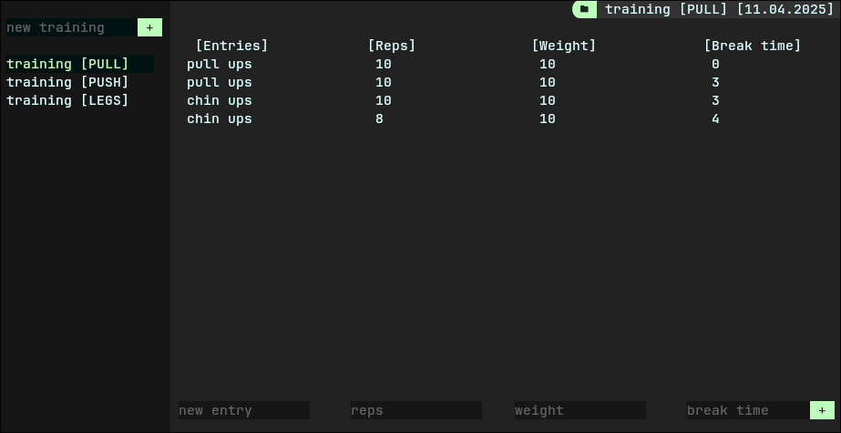

# utui
Lightweight and Flexible C++ TUI library

## Table of Contents

- [Description](#description)
- [Usage](#usage)

## Description

UTUI provides a simple and flexible way to create interactive, text based user interfaces in the terminal.



## Usage
Example code

```cpp
#include "../src/utui.h"

int main() {
  // Initialize UTUI
  UTUI::Main::init();

  // Load elements from file
  UTUI::Main::appendFromFile("index.utui");

  // Retrieve reference to button
  auto& button1 = *UTUI::Main::GetElementById<UTUI::Button>(10);

  // Set event callback
  button1.onClick.set([&]() { button1.setValue("I was clicked!"); });

  // Display all elements before main loop
  UTUI::Main::displayAll();
  while (1) {
    // Poll user input
    UTUI::Main::update();
  }
  return 0;
}
